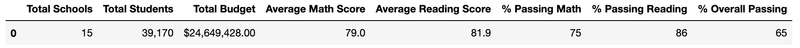
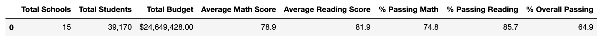

# School District Analysis

## Overview

After conducting a school district analysis, reports showed that academic dishonesty was discovered in the math and reading scores of Thomas High School 9th graders. The previous analysis must be adjusted by replacing the math and reading scores for the ninth grade students. The scores will be replaced with "NaN" values and the analysis will be conducted again.

## Analysis Results
After replacing all of the ninth graders' scores with "NaN" (as shown below):

Primary areas of focus for the second analysis were as follows:

* Average math and reading scores at Thomas High School
* Percentage of students passing according to math scores
* Percentage of students passing according to reading scores
* Overall percentage of students who passed both math and reading
* Percentage passing math, reading, and overall by budget per student
* Percentage passing math, reading, and overall by school size
* Placement of schools overall by score values relative to each other

### Reference metrics

These are the screenshot images of the metrics before and after the Thomas High School alterations.

- **Total Students**

Total number of students in the district should not change.

- **Total Budget**

The total budget reports remained unchanged by the data adjustment of test scores.

- **Average Math and Reading Scores**

By removing the test scores of the ninth graders in should be mentioned that the average math exam score for the district dropped by one-tenth of a percentage point. The average score for the district on the reading exam was unchanged.

 - **Percentage of Students Passing According To Math Scores**

After the data adjustment, it can be noted that the percentage of students passing the math exam was dropped by two-tenths of a percentage point.

- **Percentage of Students Passing According To Reading Scores**

The percentage of students in the district who passed the reading exam was lowered by three-tenths of a percentage point.

- **Overall Percentage of Students Who Passed Both Math and Reading**

Due to the data adjustment of replacing the test scores from Thomas High School with "NaN" values, the overall percentage of students who passed both the reading and math exam in the district dropped by one-tenth of a percentage point.

## Summary

Reviewing the analysis of the school district metrics after replacing the Thomas High School ninth-graders' scores with the value "NaN" yielded four noteable changes to the district metrics:

1. The average math exam score for the district was one-tenth of a percentage point lower.
2. The percentage of students who passed the math exam was lowered by two-tenths of a percentage point.
3. The percentage of students who passed the reading exam was lowered by three-tenths of a percentage point.
4. The percentage of students who passed both the math and reading exams for the districts was lowered by one-tenth of a percentage point.
